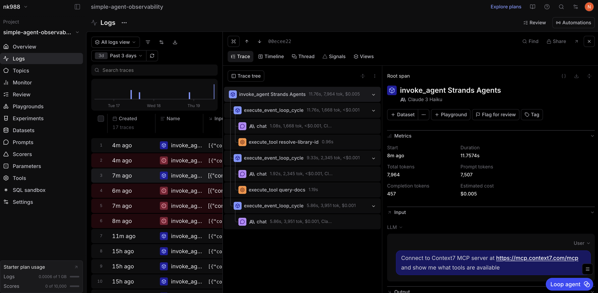
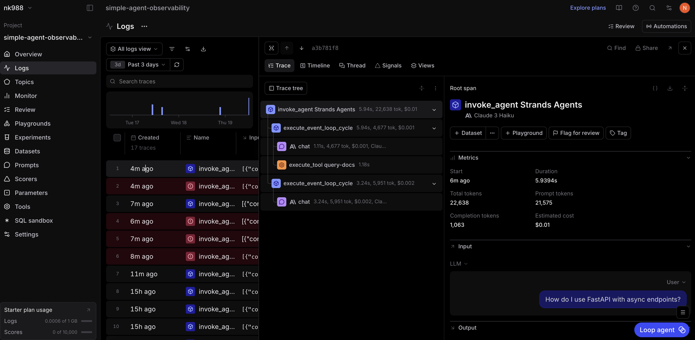

# MCP Observability Analysis 

I connected to the Context7 MCP server at https://mcp.context7.com/mcp and asked it to list the available tools. The trace shows a new span type called execute_tool resolve-library-id which is a Context7 MCP tool, unlike the DuckDuckGo tool from Problem 1. The root span ran for 11.76 seconds and used 1,944 tokens. The trace also shows two execute_event_loop_cycle spans, which follows the same two-phase pattern I saw before, but this time one of the tool calls is going out to the MCP server instead of DuckDuckGo. 

When I asked "How do I use FastAPI with async endpoints?", the agent used a Context7 tool called execute_tool query-docs instead of DuckDuckGo. This span shows the MCP tool fetching documentation directly. The trace ran for 5.93 seconds with 22,638 total tokens and cost $0.01, which is noticeably more tokens than a typical DuckDuckGo search. This maybe because the MCP tool returns full documentation content rather than short web snippets. The completion tokens (1,063) were also higher, meaning the model had richer source material to work from when writing the answer.

MCP tool calls show up in the trace tree the same way DuckDuckGo does, as execute_tool spans inside an execute_event_loop_cycle. 

The main differences is that MCP documentation tools pulled in significantly more context per call, which increased the cost but likely improved answer quality for technical questions.
