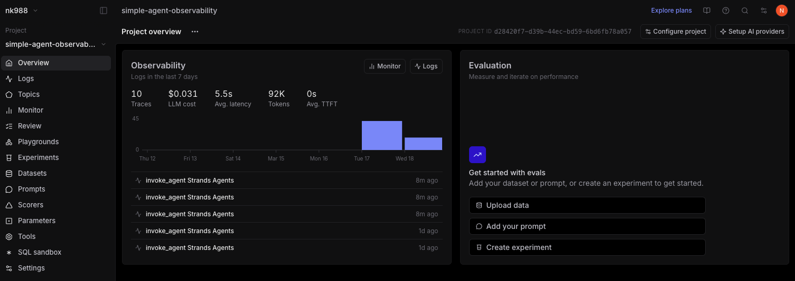
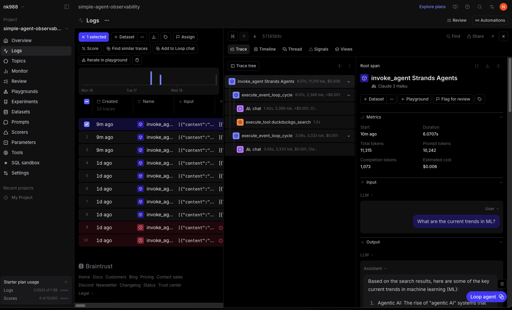
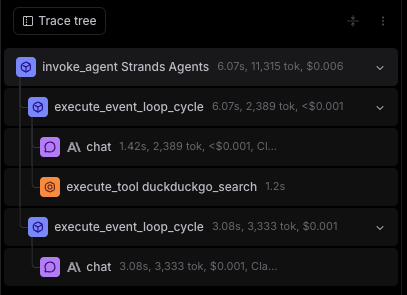
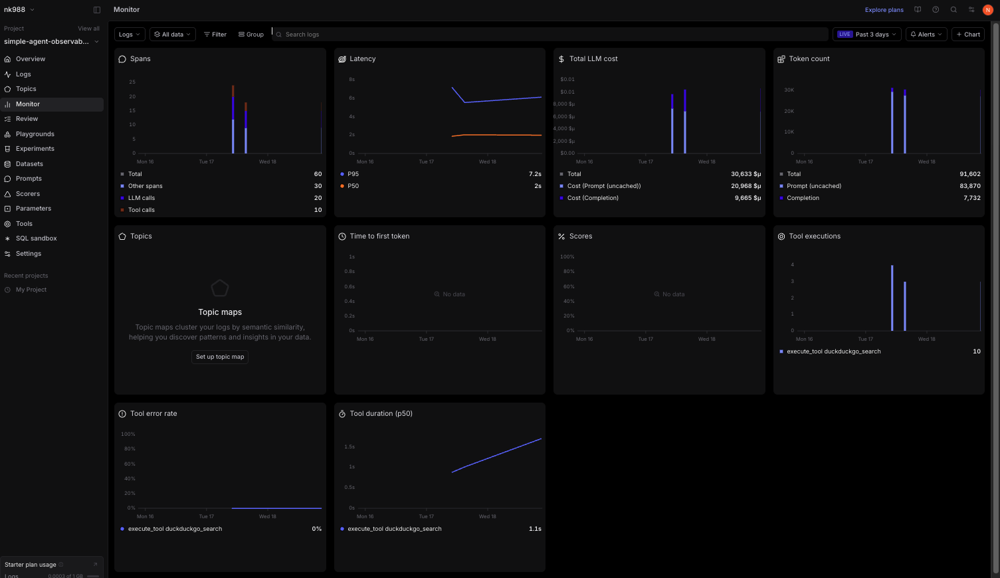

# Observability Analysis 

## Overview

Since I ran the same questions twice over 2 days, the totals are inflated across 10 traces. The overview shows an average latency of 5.5 seconds, a total LLM cost of $0.031, and 95K tokens consumes.

Each entry in the list represents one full agent run triggered by my questions. 

## Trace Details

The trace detail view shows a single agent invocation for the question "What are the current trends in AI?" The left panel lists all the spans under that trace, and the right panel shows the actual input and output for each span. Clicking into the root span reveals the full conversation context passed to the model. The trace confirms that the agent received the question, called the DuckDuckGo search tool, and then generated a response based on the search results.

The trace tree breaks down the internal execution into a two level span hierarchy. The root span "invoke_agent Strands Agents" took 6.07 seconds and consumed 11,315 tokens costing $0.006. Under it are two "execute_event_loop_cycle" spans. The first cycle contains a lightweight chat call to Claude 3 Haiku that took 1.42 seconds and used only 80 tokens, where the model decided to call the DuckDuckGo search tool. The tool execution itself took 1.2 seconds. The second cycle contains a longer chat call that took 3.08 seconds and used 396 tokens, where the model read the search results and wrote the final answer. This two step pattern repeated for all 3 of my questions, with a separate search query generated for each one.

## Metrics Dashboard

There were 60 total spans, made up of 20 LLM calls, 10 tool calls, and 30 other spans. Latency shows a P95 of 7.2 seconds and a P50 of 2 seconds, meaning most queries were fast but a few took noticeably longer. I have noticed that the input context, which includes the system prompt and search results, dominates over the actual response ( based on the token numbers). The total LLM cost came out to $0.031. The tool executions panel shows all 10 calls went to "execute_tool duckduckgo_search" with a median duration of 1.1 seconds and a 0% error rate, meaning every search call completed without failure.

## Takeaways

1. The prompt tokens siginificantly outnumbered completion tokens. This means the expensive par is not the answer generation but feeding the system prompt and search results into context every turn. I beleive caching system prompt would reduce costs significantly. 

2. The P95 and P50 gap is vast. Analysing which queries trigger longer calls or generate longer answers can help figure out where to optimize. 